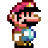

### Hi there 👋 I am Simon 

I am currently engaged in Web Development, mostly frontend but also backend.  

- 🔭 I’m currently learning and working on Front End Web Projects
- 🌱 I’m currently learning Back End Web Development

### Tech Stack

   ## Visitors

 

                    

                    
          

          

<!--
**simtak/simtak** is a ✨ _special_ ✨ repository because its `README.md` (this file) appears on your GitHub profile.

Here are some ideas to get you started:

- 🔭 I’m currently working on Front End Web Projects
- 🌱 I’m currently learning Back End Web Development
- 👯 I’m looking to collaborate on ...
- 🤔 I’m looking for help with ...
- 💬 Ask me about ...
- 📫 How to reach me: ...
- 😄 Pronouns: ...
- ⚡ Fun fact: ...
-->
